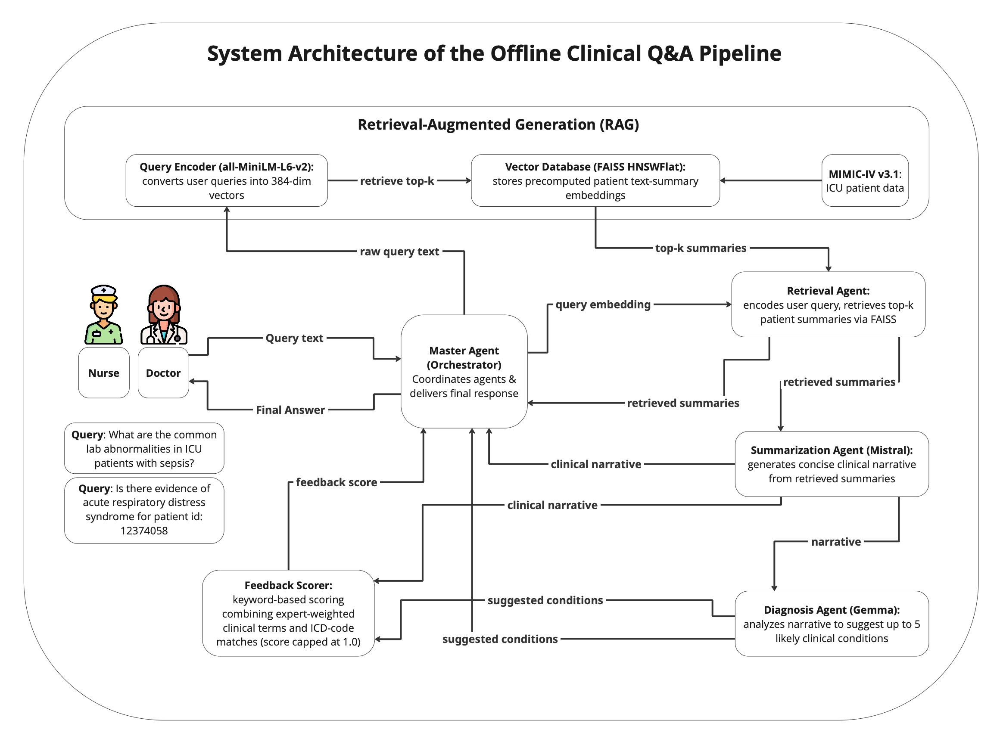

Clinical Q&A with lightweight LLMs
===========================================================

This repository contains the implementation of our study titled **"No cloud, no problem: secure and explainable offline AI agents for clinical Q\&A with lightweight LLMs"**.



## Authors

- **Ali Salman** - Department of Medical Biotechnologies, University of Siena, 53100 Siena, Italy.
- **Giuseppe Fico** - Life Supporting Technologies, Universidad Politécnica de Madrid, 28040 Madrid, Spain.
- **Ernesto Iadanza** - Department of Medical Biotechnologies, University of Siena, 53100 Siena, Italy.

## Abstract

The advancement of artificial intelligence (AI)–driven clinical decision support systems has improved healthcare automation, yet most rely on cloud-based models, raising concerns about data privacy, latency, and accessibility in resource-constrained settings. We present a fully offline AI-powered patient-level question-and-answer (Q&A) system that integrates modular agents and retrieval augmented generation (RAG) with on-premise large language models (LLMs) for clinical summarization and diagnostic support, built on the Medical Information Mart for Intensive Care (MIMIC-IV v3.1) dataset. We preprocess 6,365,019 intensive care unit (ICU) admission summaries into 384-dimensional embeddings using the all-MiniLM-L6-v2 Sentence-Transformer and index them with facebook AI similarity search (FAISS) in a hierarchical navigable small world flat (HNSWFlat) structure (M=32, efConstruction=200) at roughly 145 records/s to enable sub-second nearest-neighbor retrieval. A Retrieval Agent fetches relevant patient history, vital signs, and laboratory results; a Summarization Agent (Mistral) converts structured data into concise, coherent narratives; and a Diagnosis Agent (Gemma) proposes likely conditions from those narratives. We record clinician-provided gold-standard notes alongside each model response and employ a hybrid feedback scorer—combining expert-weighted clinical keywords with international classification of diseases (ICD) keyword matches—to refine outputs (scores capped at 1.0). In a held-out evaluation on 24 real-world clinical queries, our offline framework achieves competitive retrieval precision, recall-oriented understudy for gisting evaluation (ROUGE-L) and bidirectional encoder representations from transformers score (BERTScore) summary quality, and top-3 diagnostic accuracy—while guaranteeing full on-site data residency and zero reliance on external application programming interfaces (APIs). This work demonstrates that sub-8 billion-parameter LLMs can deliver secure, explainable clinical Q\&A entirely offline, paving the way for deployment in privacy-sensitive or connectivity-limited healthcare environments. Future work will explore fine-tuning on medical corpora and dynamic agent orchestration for real-time hospital integration.

## Citation

If you use this work, please cite it as:

```bibtex
@misc{salman2025BRSET_DR,
  author       = {Ali Salman and Giuseppe Fico and Ernesto Iadanza},
  title        = {No cloud, no problem: secure and explainable offline AI agents for clinical Q\&A with lightweight LLMs},
  year         = {2025},
  institution  = {Department of Medical Biotechnologies - University of Siena, Siena, Italy},
  note         = {Available on GitHub: https://github.com/alexsalman/mimiciv_project},
  url          = {https://github.com/alexsalman/mimiciv_project}
  urldate      = {2025-06-30}
}


# mimiciv_project

[](LICENSE)

---

## 🚀 Quick Start

```bash
git clone https://github.com/alexsalman/mimiciv_project.git
cd mimiciv_project
pip install -r requirements.txt
pip install -e .

📦 Installation
	1.	Clone the repo
	2.	Activate your Python 3.8+ environment
	3.	Install dependencies:
      pip install -r requirements.txt
      pip install -e .

🖥️ Usage
mimiciv-cli "elderly patient with chest pain and cough" -k 3

Python API
from mimiciv_project.agents.master_agent import MasterAgent

agent = MasterAgent()
out = agent.handle_query("ICU patient with sepsis and hypotension", top_k=2)
print("Summary:",        out["summary"])
print("Diagnoses:",      out["diagnoses"])
print("Feedback Score:", out["feedback_score"])

📂 Project Structure
mimiciv_project/
├── src/mimiciv_project/
│   ├── agents/              # Retrieval, Summarization, Diagnosis, MasterAgent
│   ├── utils/               # scoring_utils, feedback_logger, etc.
│   └── cli.py               # `mimiciv-cli` entrypoint
├── data/
│   ├── raw/                 # original MIMIC-IV CSVs
│   └── processed/           # summaries, embeddings, FAISS index
├── scripts/                 # ETL & embedding-generation scripts
├── notebooks/               # profiling & demo notebooks
├── tests/                   # pytest unit tests
├── requirements.txt
├── pyproject.toml
└── README.md

⸻
© 2025 Ali Salman · MIT License
